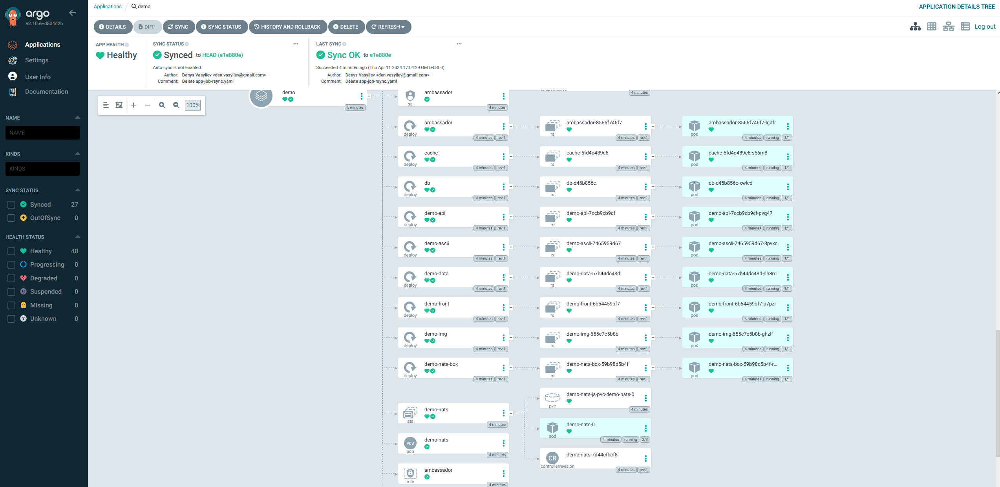

# Minimum Viable Product (MVP):

`Ціль:` Створити мінімальний функціональний продукт, який може вивести на ринок та отримати зворотний зв'язок від користувачів. В нашому випадку це демонтрація роботи застосунку `AsciiArtify`

`Зміст документації:` Документація MVP повинна включати більше деталей порівняно із PoC. Зазвичай це включає визначення функціональних вимог, дизайн інтерфейсу, технічну архітектуру, план виконання, тестовий план, план масштабування та стратегію впровадження.

1. Перевіряємо роботу застосунку AsciiArtify
- Переадресуємо порти наступною командою:
```bash
@ASEMUA ➜ /workspaces/go-demo (master) $ kubectl port-forward svc/argocd-server -n argocd 8090:443&
[1] 35712
@ASEMUA ➜ /workspaces/go-demo (master) $ Forwarding from 127.0.0.1:8090 -> 8080
Forwarding from [::1]:8090 -> 8080
Handling connection for 8090
Handling connection for 8090
Handling connection for 8090
Handling connection for 8090
```

- Наче все добре

  

- Перевіримо зміни:
```bash
@ASEMUA ➜ /workspaces/go-demo (master) $ kubectl get svc -n demo
NAME               TYPE        CLUSTER-IP      EXTERNAL-IP   PORT(S)                                                 AGE
demo-nats          ClusterIP   None            <none>        4222/TCP,6222/TCP,8222/TCP,7777/TCP,7422/TCP,7522/TCP   66m
ambassador-admin   ClusterIP   10.43.199.124   <none>        8877/TCP                                                66m
cache              ClusterIP   10.43.31.182    <none>        6379/TCP                                                66m
db                 ClusterIP   10.43.7.151     <none>        3306/TCP                                                66m
ambassador         NodePort    10.43.119.106   <none>        80:32681/TCP                                            66m
demo-api           ClusterIP   10.43.168.6     <none>        80/TCP                                                  66m
demo-data          ClusterIP   10.43.62.146    <none>        80/TCP                                                  66m
demo-ascii         ClusterIP   10.43.239.79    <none>        80/TCP                                                  66m
demo-front         ClusterIP   10.43.132.219   <none>        80/TCP                                                  66m
demo-img           ClusterIP   10.43.111.125   <none>        80/TCP                                                  66m
```
- Прокидаємо порт до svc/ambassador
```bash
@ASEMUA ➜ /workspaces/go-demo (master) $ kubectl port-forward -n demo svc/ambassador 8091:80
Forwarding from 127.0.0.1:8091 -> 80
Forwarding from [::1]:8091 -> 80
Handling connection for 8091
Handling connection for 8091
```
- Зробимо запит на вказаний порт та отримаємо відповідь у вигляді версії додатку:  
```bash
@ASEMUA ➜ /workspaces/go-demo (master) $ curl localhost:8091
k8sdiy-api:599e1af

```

3. Перевіримо роботу застосунка 
- Для цього завантажимо файл що зберігається у нас в локальному сховищі на вітдалений сервер командою:
```bash
@ASEMUA ➜ /workspaces/go-demo (master) $ wget -O /tmp/ua.png https://static.drukukr.com/catalog/16/flag-00029__1400444380__615.jpg
--2024-04-11 15:23:15--  https://static.drukukr.com/catalog/16/flag-00029__1400444380__615.jpg
Resolving static.drukukr.com (static.drukukr.com)... 193.169.189.62
Connecting to static.drukukr.com (static.drukukr.com)|193.169.189.62|:443... connected.
HTTP request sent, awaiting response... 200 OK
Length: 25399 (25K) [image/jpeg]
Saving to: ‘/tmp/ua.png’

/tmp/ua.png                                      100%[========================================================================================================>]  24.80K  --.-KB/s    in 0s      

2024-04-11 15:23:15 (241 MB/s) - ‘/tmp/ua.png’ saved [25399/25399]

@ASEMUA ➜ /workspaces/go-demo (master) $ curl -F 'image=@/tmp/ua.png' localhost:8091/img/
ttttttttttttttttttttttttttttttttttttttttttttttttttttttttttttttttttttttttttttttttttttttttttttttttttttttttttttttttttttttttttt
ttttttttttttttttttttttttttttttttttttttttttttttttttttttttttttttttttttttttttttttttttttttttttttttttttttttttttttttttttttttttttt
ttttttttttttttttttttttttttttttttttttttttttttttttttttttttttttttttttttttttttttttttttttttttttttttttttttttttttttttttttttttttttt
tttttt1fft1tLt1tft1tttttttttttttttttttttttttttttttttttttttttttttttttttttttttttttttttttttttttttttttttttttttttttttttttttttttt
tttttt1fff1tLttfff1tttttttttttttttttttttttttttttttttttttttttttttttttttttttttttttttttttttttttttttttttttttttttttttttttttttttt
tttttt1ftfttL1fftf1tttttttttttttttttttttttttttttttttttttttttttttttttttttttttttttttttttttttttttttttttttttttttttttttttttttttt
tttttt1ftfttLtffff1tttttttttttttttttttttttttttttttttttttttttttttttttttttttttttttttttttttttttttttttttttttttttttttttttttttttt
tttttt1ffffftftfff1tttttttttttttttttttttttttttttttttttttttttttttttttttttttttttttttttttttttttttttttttttttttttttttttttttttttt
tttttt1fftLfffLtff1tttttttttttttttttttttttttttttttttttttttttttttttttttttttttttttttttttttttttttttttttttttttttttttttttttttttt
ttttttttttffLffttttt1tttttttttttttttttttttttttttttttttttttttttttttttttttttttttttttttttttttttttttttttttttttttttttttttttttttt
ttttttttttttftttttttttttttttttttttttttttttttttttttttttttttttttttttttttttttttttttttttttttttttttttttttttttttttttttttttttttttt
ttttttttttttttttttttttttttttttttttttttttttttttttttttttttttttttttttttttttttttttttttttttttttttttttttttttttttttttttttttttttttt
ttttttttttttttttttttttttttttttttttttttttttttttttttttttttttttttttttttttttttttttttttttttttttttttttttttttttttttttttttttttttttt
ttttttttttttttttttttttttttttttttttttttttttttttttttttttttttttttttttttttttttttttttttttttttttttttttttttttttttttttttttttttttttt
ttttttttttttttttttttttttttttttttttttttttttttttttttttttttttttttttttttttttttttttttttttttttttttttttttttttttttttttttttttttttttt
ttttttttttttttttttttttttttttttttttttttttttttttttttttttttttttttttttttttttttttttttttttttttttttttttttttttttttttttttttttttttttt
111111111111111111111111111111111111111111111111111111111111111111111111111111111111111111111111111111111111111111111111111
fffffffffffffffffffffffffffffffffffffffffffffffffffffffffffffffffffffffffffffffffffffffffffffffffffffffffffffffffffffffffff
LLLLLLLLLLLLLLLLLLLLLLLLLLLLLLLLLLLLLLLLLLLLLLLLLLLLLLLLLLLLLLLLLLLLLLLLLLLLLLLLLLLLLLLLLLLLLLLLLLLLLLLLLLLLLLLLLLLLLLLLLLL
LLLLLLLLLLLLLLLLLLLLLLLLLLLLLLLLLLLLLLLLLLLLLLLLLLLLLLLLLLLLLLLLLLLLLLLLLLLLLLLLLLLLLLLLLLLLLLLLLLLLLLLLLLLLLLLLLLLLLLLLLLL
LLLLLLLLLLLLLLLLLLLLLLLLLLLLLLLLLLLLLLLLLLLLLLLLLLLLLLLLLLLLLLLLLLLLLLLLLLLLLLLLLLLLLLLLLLLLLLLLLLLLLLLLLLLLLLLLLLLLLLLLLLL
LLLLLLLLLLLLLLLLLLLLLLLLLLLLLLLLLLLLLLLLLLLLLLLLLLLLLLLLLLLLLLLLLLLLLLLLLLLLLLLLLLLLLLLLLLLLLLLLLLLLLLLLLLLLLLLLLLLLLLLLLLL
LLLLLLLLLLLLLLLLLLLLLLLLLLLLLLLLLLLLLLLLLLLLLLLLLLLLLLLLLLLLLLLLLLLLLLLLLLLLLLLLLLLLLLLLLLLLLLLLLLLLLLLLLLLLLLLLLLLLLLLLLLL
LLLLLLLLLLLLLLLLLLLLLLLLLLLLLLLLLLLLLLLLLLLLLLLLLLLLLLLLLLLLLLLLLLLLLLLLLLLLLLLLLLLLLLLLLLLLLLLLLLLLLLLLLLLLLLLLLLLLLLLLLLL
LLLLLLLLLLLLLLLLLLLLLLLLLLLLLLLLLLLLLLLLLLLLLLLLLLLLLLLLLLLLLLLLLLLLLLLLLLLLLLLLLLLLLLLLLLLLLLLLLLLLLLLLLLLLLLLLLLLLLLLLLLL
LLLLLLLLLLLLLLLLLLLLLLLLLLLLLLLLLLLLLLLLLLLLLLLLLLLLLLLLLLLLLLLLLLLLLLLLLLLLLLLLLLLLLLLLLLLLLLLLLLLLLLLLLLLLLLLLLLLLLLLLLLL
LLLLLLLLLLLLLLLLLLLLLLLLLLLLLLLLLLLLLLLLLLLLLLLLLLLLLLLLLLLLLLLLLLLLLLLLLLLLLLLLLLLLLLLLLLLLLLLLLLLLLLLLLLLLLLLLLLLLLLLLLLL
LLLLLLLLLLLLLLLLLLLLLLLLLLLLLLLLLLLLLLLLLLLLLLLLLLLLLLLLLLLLLLLLLLLLLLLLLLLLLLLLLLLLLLLLLLLLLLLLLLLLLLLLLLLLLLLLLLLLLLLLLLL
LLLLLLLLLLLLLLLLLLLLLLLLLLLLLLLLLLLLLLLLLLLLLLLLLLLLLLLLLLLLLLLLLLLLLLLLLLLLLLLLLLLLLLLLLLLLLLLLLLLLLLLLLLLLLLLLLLLLLLLLLLL
LLLLLLLLLLLLLLLLLLLLLLLLLLLLLLLLLLLLLLLLLLLLLLLLLLLLLLLLLLLLLLLLLLLLLLLLLLLLLLLLLLLLLLLLLLLLLLLLLLLLLLLLLLLLLLLLLLLLLLLLLLL
LLLLLLLLLLLLLLLLLLLLLLLLLLLLLLLLLLLLLLLLLLLLLLLLLLLLLLLLLLLLLLLLLLLLLLLLLLLLLLLLLLLLLLLLLLLLLLLLLLLLLLLLLLLLLLLLLLLLLLLLLLL
LLLLLLLLLLLLLLLLLLLLLLLLLLLLLLLLLLLLLLLLLLLLLLLLLLLLLLLLLLLLLLLLLLLLLLLLLLLLLLLLLLLLLLLLLLLLLLLLLLLLLLLLLLLLLLLLLLLLLLLLLLL
LLLLLLLLLLLLLLLLLLLLLLLLLLLLLLLLLLLLLLLLLLLLLLLLLLLLLLLLLLLLLLLLLLLLLLLLLLLLLLLLLLLLLLLLLLLLLLLLLLLLLLLLLLLLLLLLLLLLLLLLLLL
LLLLLLLLLLLLLLLLLLLLLLLLLLLLLLLLLLLLLLLLLLLLLLLLLLLLLLLLLLLLLLLLLLLLLLLLLLLLLLLLLLLLLLLLLLLLLLLLLLLLLLLLLLLLLLLLLLLLLLLLLLL
LLLLLLLLLLLLLLLLLLLLLLLLLLLLLLLLLLLLLLLLLLLLLLLLLLLLLLLLLLLLLLLLLLLLLLLLLLLLLLLLLLLLLLLLLLLLLLLLLLLLLLLLLLLLLLLLLLLLLLLLLLL
```


